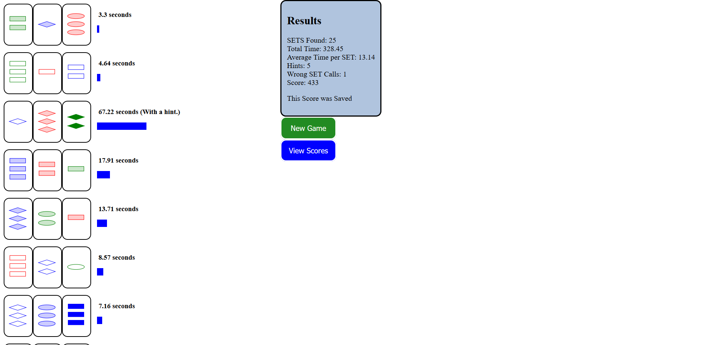

[](https://bettercodehub.com/)

# SET game
> This project is an implementation of the card game SET.

## Table of contents
* [General info](#general-info)
* [Screenshots](#screenshots)
* [Technologies](#technologies)
* [Setup](#setup)
* [Future Development](#Future-Development)
* [Status](#status)
* [Contact](#contact)

## General info
The card game SET was designed by Marsha Falco, published by Set Enterprises and played a lot by me. In this (hobby) project I implemented this game to exercise and display my skills in building a web application.

I tried to limit the use of third party libraries (like Bootstrap or JQuery) 
to avoid adding unneccessary complexity into a small project. And also because I wanted to exercise the bare web technologies.

## Screenshots



## Technologies
* Python - version 3.8.2
* Django - version 3.0.5
* Firefox - version 76.0.1
* db.sqlite3

## Setup
Download or clone this project. 

To install the requirements use the following: (consider using a virtual environment)
```
pip install -r requirements.txt
```
Go into the directory and start the server with:
```
python manage.py runserver
```
Go to your browser (Firefox is recommended) and visit:
```
localhost:8000
```

This app was also deployed to <https://orinsetgame.herokuapp.com/> just to see how that worked out. There are some expected errors because the database (sqlite3) is not suitable for usage like this.

## Future Development
To-do list:

* Explain the score function being used on the pages with highscores
* Add functional testing with Selenium
* Improve styling
* Add timer on game page, to see live how long the search for a set is taking

## Status
Project is: _in progress_

## License
Copyright © 2020, [Orin Habich](https://github.com/0rin/setgame).
Released as [unlicensed](LICENSE) public domain release.

## Contact
Created by Orin Habich. Feel free to contact me!  
<orinhabich@gmail.com>
